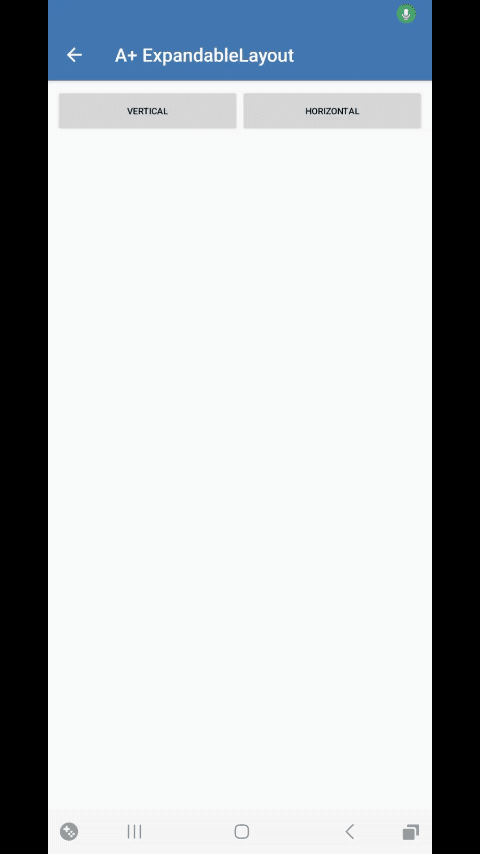

</br><b>Expandable-Layout</b> Es un sistema que te permitira crear menús ocultos que con un click se mostraran con una animación, asi como se puede expandir se puede ocultar nuevamente.
    </br> </br>
    
  
    
 ## Importación
 
Importa todos los archivos a tú proyecto, esto incluye también "attr.xml". En esta ocacion hay que modificar otra parte del código de "ExpandableLayout.java", solo reemplaza "your.package" con el paquete de tú proyecto.
 
 ```java
import android.widget.LinearLayout;

import static your.package.ExpandableLayout.State.COLLAPSED;
import static your.package.ExpandableLayout.State.COLLAPSING;
import static your.package.ExpandableLayout.State.EXPANDED;
import static your.package.ExpandableLayout.State.EXPANDING;


public class ExpandableLayout extends LinearLayout {
```

## Inicio

Crea un ExpandableLayout con XML Vertical:

```xml
<com.my.newproject2.ExpandableLayout
		android:id="@+id/expandedLayout"
		android:layout_width="match_parent"
		android:layout_height="180dp"
		android:padding="8dp"
		android:background="#E3E9F5"
		android:gravity="center_horizontal|center_vertical"
		android:orientation="vertical"
		app:el_expanded="true">
		<TextView
			android:id="@+id/textview1"
			android:layout_width="wrap_content"
			android:layout_height="wrap_content"
			android:padding="8dp"
			android:text="Expanded Layout v"
			android:textSize="20sp"
			android:textColor="#000000" />
		<TextView
			android:id="@+id/textview2"
			android:layout_width="wrap_content"
			android:layout_height="wrap_content"
			android:padding="8dp"
			android:text="App + Developer"
			android:textSize="12sp"
			android:textColor="#000000" />
	</com.my.newproject2.ExpandableLayout>
	```
	
Horizontal:
	
	```xml
	<com.my.newproject2.ExpandableLayout
		android:id="@+id/expandedLayouth"
		android:layout_width="match_parent"
		android:layout_height="180dp"
		android:padding="8dp"
		android:background="#E3E9F5"
		android:gravity="center_horizontal|center_vertical"
		android:orientation="horizontal"
		app:el_expanded="true">
		<TextView
			android:id="@+id/textview3"
			android:layout_width="wrap_content"
			android:layout_height="wrap_content"
			android:padding="8dp"
			android:text="Expanded Layout v"
			android:textSize="20sp"
			android:textColor="#000000" />
		<TextView
			android:id="@+id/textview4"
			android:layout_width="wrap_content"
			android:layout_height="wrap_content"
			android:padding="8dp"
			android:text="App + Developer"
			android:textSize="12sp"
			android:textColor="#000000" />
			```
			
## Funciones

Estas son las opciones que podemos disponer de nuestro ExpandableLayout:

```java
//Expander
expandedLayout.expand();

//Contraer
expandedLayout.collapse();

//Verifica si esta expandido
expandedLayout.isExpanded()
```

## Ejemplo

Supongamos que tienes un botón y que al precionarlo verifique si esta expandido el layout, si lo esta lo contraera y si no lo expandira:

```java
myButton.setOnClickListener(new View.OnClickListener() {
			@Override
			public void onClick(View _view) {
				if (expandedLayout.isExpanded()) {
					expandedLayout.collapse();
				} else {
					expandedLayout.expand();
				}
			}
		});
```
